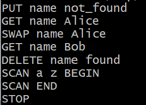
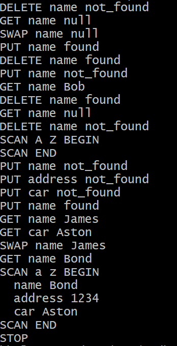
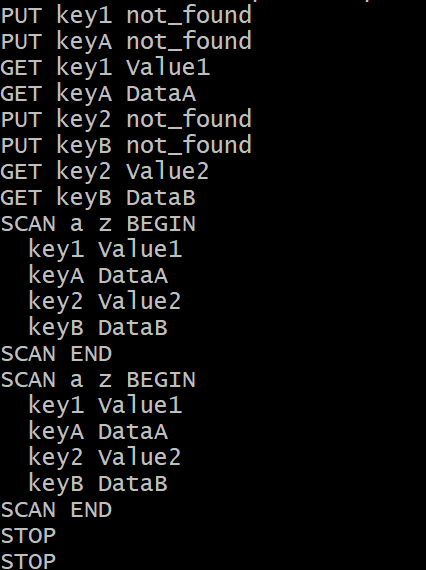
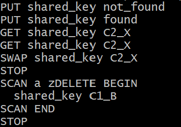
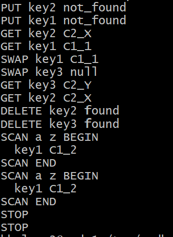
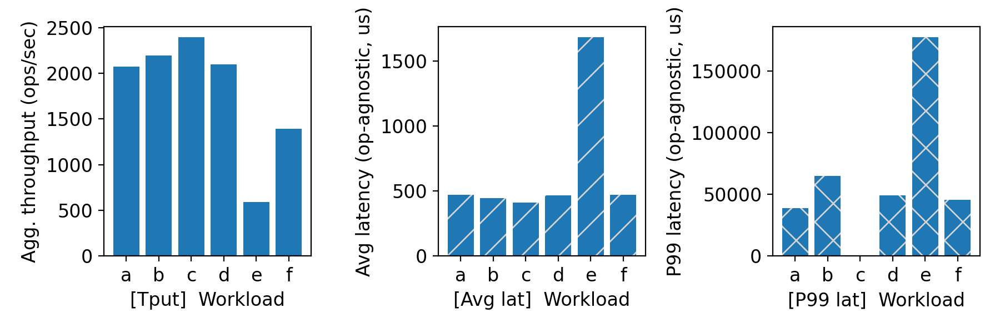
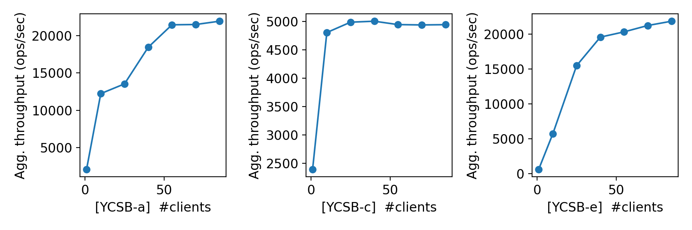
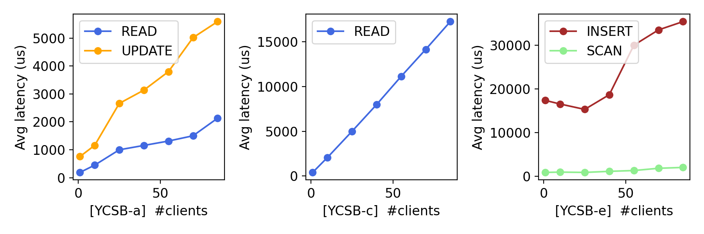

# CS 739 MadKV Project 1

**Group members**: 
Blake Holman `bholman2@wisc.edu`,
Tyler Avret `avret@wisc.edu`

## Design Walkthrough

### Code structure
The project followed a modular design structure with the following files:
- server.go - Server logic for handling requests
- client.go - Implements gRPC for interaction with the kvstore
- kvstore.proto - Defines the gRPC services 

### Server design
The server utilized Go’s built-in goroutines for concurrent request handling. Each function included a mutex lock for data race prevention.

### RPC protocol between server and clients
This system uses Go’s built-in gRPC module. The protocol buffers were defined in the kvstore.proto file.

## Self-provided Testcases

<u>Found the following testcase results:</u> 1, 2, 3, 4, 5

### Explanations

For this project, we created five different test cases.

#### Single client
Test 1 and 2 ensure that the operations for a single client work as expected.
Test 1, seen below, shows the client can process simple tasks, and it ensures that the server maintains the key/value and responds correctly to the client.

Test 2, shown below, tests the server's ability to handle and respond to overlapping requests correctly.

Both of these tests confirm that the server is able to handle different requests from the client and respond correctly, and they confirm that the client is able to receive the response from the server.

#### Concurrent clients
Test 3 ensured our server was capable of handling multiple client requests concurrently. For this test, shown below, there were no conflicting commands by the clients.

This test proved that the server was able to handle multiple clients.

#### Concurrent interfering clients
Test 4 and 5 tested our server to ensure that it was capable of handling multiple clients issuing interfering requests.

Test 4, shown below, focuses on overlapping requests from two clients. Both clients try to read and write a shared key.

As seen in the image, the server is able to block conflicting read-read requests and read-write requests for the same key. However, since we use read-write locks in our server, we can see a potential read-write conflict. This issue is explained in the additional details section.

Test 5, shown below, ensures that interfering requests using different key names are handled properly by the server.

As seen above, the server is able to block concurrent writes while allowing different clients to manipulate keys made by another client. This test also shows that one client's actions impacts the entire key-value store, which impacts keys for the other clients.

## Fuzz Testing

<u>Parsed the following fuzz testing results:</u>

num_clis | conflict | outcome
:-: | :-: | :-:
1 | no | PASSED
3 | no | PASSED
3 | yes | PASSED

### Comments

#### Single client
The first test inserted, retrieved, and deleted random key-value pairs for one client. It was successful and exhibited no conflicts. This shows that there were no crashes or data corruption.

#### Concurrent clients, no conflicts
The second test consisted of three clients sending unique keys simultaneously. It was successful and exhibited no conflicts. This shows the thread safety and security using the mutex locks for each goroutine.

#### Concurrent interfering clients
The last test consisted of three clients writing the same key simultaneously. The test passed but did experience conflicts. 

## YCSB Benchmarking

<u>Single-client throughput/latency across workloads:</u>

<u>Agg. throughput trend vs. number of clients:</u>

<u>Avg. & P99 latency trend vs. number of clients:</u>

### Comments

The YCSB workloads are as follows:
- A - Update heavy (Read 50%, Update 50%)
- B - Read mostly (Read 95%, Update 5%)
- C - Read only (Read 100%, Update 0%)
- D - Read latest (Read 95%, Update 0%, Insert 5%)
- E - Short ranges (Scan 95%, Insert 5%)
- F - Read-modify-wrtie  (Read 50%, read-modify-write 50%)

Source: YCSB/workloads at master · brianfrankcooper/YCSB

#### Aggregate Throughput for a single client
The aggregate throughput for a single client was fairly consistent for workloads a-d, with a range of 2000-2400 ops/sec. Workload f was lower with approximately 1500 ops/sec. Workload e had the lowest throughput by far with approximately 600 ops/sec. 

*Reasoning* - Workload e had the lowest throughput due to heavy scanning. The assumption we made was that the scans were sequential. Workloads b-d have higher throughput due to their read-heavy nature.

#### Average Latency
The average latency for workloads a, b, c, d, and f, were all consistent and hovered just below 500 ops/us. The average latency for workload e was over three times higher at approximately 1600 ops/us. 

*Reasoning* - If our assumptions about the aggregate throughput are correct, then it follows that workload e’s sequential scan would have the highest latency. 

#### 99th Percentile Latency
The latency for the last 1% of each workload varied more greatly than the aggregate throughput and average latency mentioned above. Workloads a, d, and f were close. Workload b was slightly higher and workload e was more than twice as high. Workload c was not shown in the bar chart. 

*Reasoning* - The reasoning for the last 1% of each workload follows the same reasoning as the average latency mentioned above. Workload e would naturally have higher latency. 

#### Aggregate Throughput for multiple clients
Workload c scales the best. This is evident from the abrupt increase in throughput as more clients are introduced. However, workload c quickly levels off. Workloads a and e appear to have roughly similar throughput growth as the number of clients increases. 

*Reasoning* - Workload c increases so quickly because there is no overhead from writing, inserting, or scanning. It levels off quickly of the use of read-write locks. Since our server allows multiple reads at one time by multiple clients, there is minimal overhead for additional clients reading.

## Additional Discussion

For our server implementation, we decided to use read-write locks. The intent of using these locks was to ensure that multiple clients could read the same key from the server simultaneously. If we used regular locks, the server would prevent two clients from reading the same key at the same time. Instead, it would let one client read at a time. This would slow down the server process when multiple clients are using read requests. However, using the read-write locks does introduce a potential conflict. Specifically, when the SCAN command is used concurrently with a write request from another client. Since SCAN uses a read lock on each key as it reads them and sends it to the server, a write request may be permitted before the scan is completed. This leads to potential issues with phantom reads or deleting keys prematurely. As we saw in Test 4, shown in the test explanation section, a DELETE request is occurring as the SCAN is also occurring. In this example, since there is only one key, SCAN is able to lock the key before DELETE removes it. This may be the preferred operation in most cases. However, if more keys are introduced, the DELETE request may remove a key before SCAN is able to read it to the client even though the SCAN request occurred first. 

